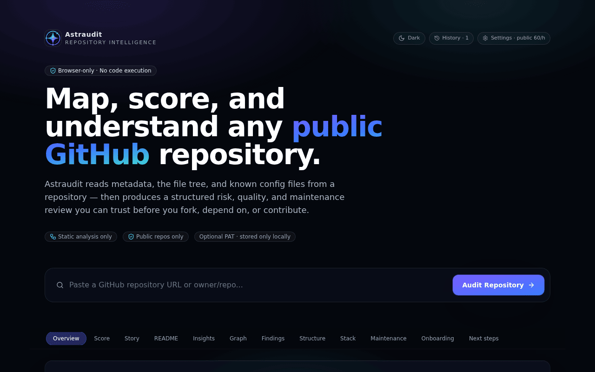
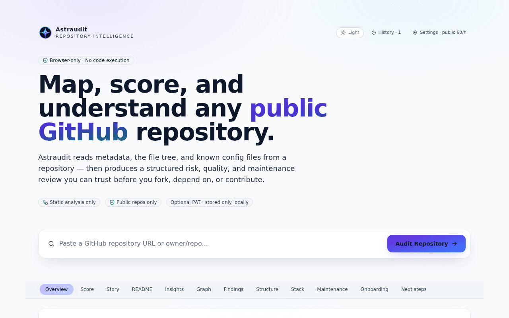
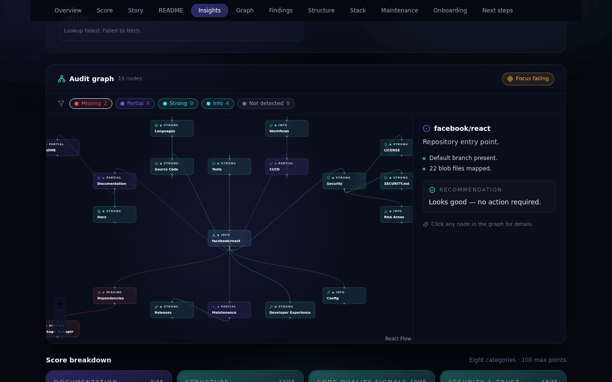
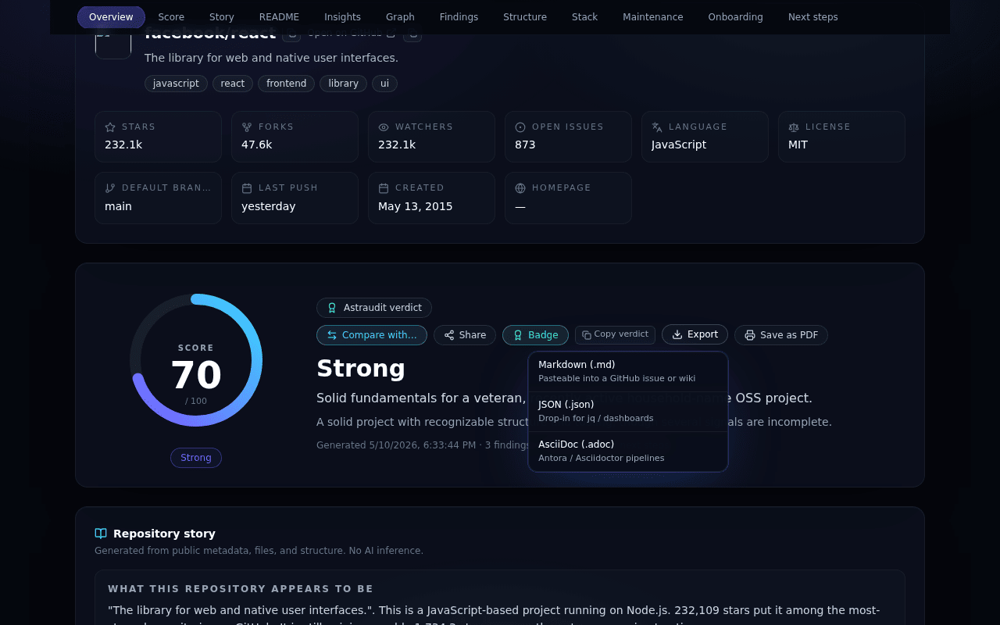
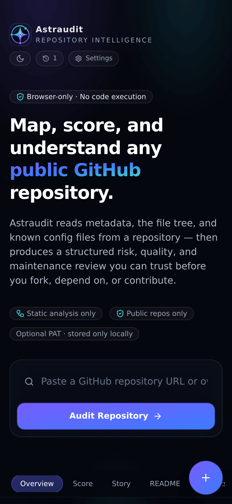
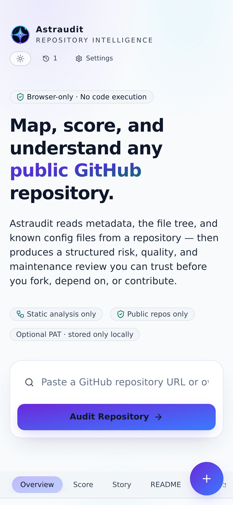

<div align="center">
  

  <h1>Astraudit</h1>

  <p><strong>Map, score, and understand any public GitHub repository — entirely in your browser.</strong></p>

  <p>
    <a href="https://beko2210.github.io/astraudit/"></a>
    <a href="https://github.com/BEKO2210/astraudit/actions/workflows/playwright.yml"></a>
    <a href="https://github.com/BEKO2210/astraudit/actions/workflows/quality.yml"></a>
    <a href="https://github.com/BEKO2210/astraudit/actions/workflows/codeql.yml"></a>
    
    
    
    
    
    
  </p>
</div>

---

> **TL;DR** — paste a `github.com/owner/repo` URL, get a 100‑point readiness score across eight categories, an interactive audit graph, prioritized next steps, and a printable PDF report. **No backend. No login. No tokens. No AI inference.**

<p align="center">
  
</p>

---

## Table of contents

- [What Astraudit does](#what-astraudit-does)
- [Screenshots](#screenshots)
- [How it works](#how-it-works)
- [The eight scored categories](#the-eight-scored-categories)
- [Exports & sharing](#exports--sharing)
- [Operating constraints](#operating-constraints)
- [What Astraudit will never do](#what-astraudit-will-never-do)
- [Local development](#local-development)
- [Testing & CI](#testing--ci)
- [Deployment](#deployment)
- [Project structure](#project-structure)
- [Roadmap & contributions](#roadmap--contributions)

---

## What Astraudit does

Drop a `github.com/owner/repo` URL into the search box. Astraudit then:

1. **Fetches** repository metadata, the file tree, README, key config files, the org's `.github` repo (community‑health fallback), recent commits, releases, and an issue snapshot — all from GitHub's public REST API.
2. **Detects** the stack: language profile, runtime, package manager, frameworks, build / test / lint tooling, monorepo signals, and ecosystem.
3. **Runs ~70 rule‑based detectors** across documentation, structure, code quality, security, maintenance, developer experience, ecosystem, and CI/CD.
4. **Scores** the repo 0–100 across eight weighted categories and assigns a letter‑style grade ("Strong", "Risky", "Avoid", …).
5. **Renders** a structured Repo Story, an interactive audit graph, a filterable findings list, an onboarding recipe, and prioritized next steps.

Everything runs locally in the browser. The audit engine ships in a dedicated Web Worker so the UI stays smooth even on large repositories.

---

## Screenshots

### Desktop (1280 × 800)

<table width="100%">
  <tr>
    <td width="50%" valign="top">
      <p align="center"><strong>Dark theme</strong> — the default.</p>
      
    </td>
    <td width="50%" valign="top">
      <p align="center"><strong>Light theme</strong> — full WCAG AA contrast.</p>
      
    </td>
  </tr>
</table>

### Audit graph

The interactive React Flow graph color‑codes every detector by status (`strong` / `partial` / `missing` / `info`), shows evidence on click, and includes a one‑click **Focus failing** affordance to fly the viewport over weak nodes only.

<p align="center">
  
</p>

### Multi‑format export

Every audit can be downloaded as **Markdown**, **JSON**, or **AsciiDoc** — or printed to PDF via a dedicated print stylesheet that strips chrome, remaps colours, and avoids splitting cards across page boundaries.

<p align="center">
  
</p>

### Mobile (390 × 844, iPhone 14 Pro)

<table width="100%">
  <tr>
    <td width="50%" valign="top">
      <p align="center"><strong>Dark theme</strong></p>
      
    </td>
    <td width="50%" valign="top">
      <p align="center"><strong>Light theme</strong></p>
      
    </td>
  </tr>
</table>

The viewport‑pinned **floating action button** (bottom‑right) opens a Material‑3‑style speed‑dial cluster with Compare, Share, Badge, and Save‑as‑PDF actions. Below the `md` breakpoint, the audit graph hands the touch stream back to the page so vertical scrolling never wobbles.

---

## How it works

<p align="center">
  
</p>

Detectors live in [`src/lib/audit/`](./src/lib/audit/) — one module per concern (`securityDetector.ts`, `dependencyDetector.ts`, `ciDetector.ts`, …). The `auditEngine` orchestrates them, the `scoreEngine` weights the outputs, the `graphEngine` renders the relationships, and the `copyEngine` writes the human‑readable story.

---

## The eight scored categories

| # | Category | Max | Examples of what it inspects |
|---|---|---:|---|
| 1 | **Documentation** | 15 | README presence + length, install / usage sections, badges, table of contents, CHANGELOG, public docs folder |
| 2 | **Structure** | 15 | Recognized top‑level layout, src/tests separation, lockfile presence, monorepo signals, suspicious filenames |
| 3 | **Code Quality Signals** | 15 | TypeScript / strict mode, ESLint + Prettier configs, test fixtures, scripts coverage |
| 4 | **Security & Trust** | 15 | LICENSE, SECURITY.md (incl. org `.github` fallback), CODEOWNERS coverage, Dependabot config, CodeQL workflow, committed `.env` |
| 5 | **Maintenance** | 15 | Push freshness, recent commit cadence, release flow, open issue / PR ratio, distinct authors |
| 6 | **Developer Experience** | 10 | `.env.example`, Dockerfile, docker‑compose, Makefile, examples folder, CONTRIBUTING.md |
| 7 | **Ecosystem & Dependencies** | 10 | Manifest health, runtime/dev dep counts, registry lookups (npm / PyPI / crates.io), CHANGELOG sanity |
| 8 | **CI/CD & Automation** |  5 | `.github/workflows/` content, deployment workflows, automated test runs |

The full per‑detector contract is documented in [`docs/RULES.md`](./docs/RULES.md) and rendered in‑app at [`#/rules`](https://beko2210.github.io/astraudit/#/rules).

---

## Exports & sharing

| Output | Use it for |
|---|---|
| **PDF** (browser print) | Stakeholder hand‑off; archive with the rest of your due‑diligence docs |
| **Markdown** (`.md`) | Paste straight into a GitHub issue, PR description, or Notion page |
| **JSON** (`.json`) | Pipe into `jq`, dashboards, or CI gates — versioned schema |
| **AsciiDoc** (`.adoc`) | Antora / Asciidoctor docs pipelines |
| **Share URL** | `https://…/astraudit/#/audit/owner/repo` — opens straight into the audit |
| **Compare URL** | `https://…/astraudit/#/compare/owner/repo+other/repo` — side‑by‑side diff |
| **SVG badge** | A README badge with the live score + grade (`docs/RULES.md` covers the schema) |

Filenames follow `astraudit-{owner}-{repo}-{YYYY-MM-DD}.{ext}` and slugify special characters so Safari's Content‑Disposition parser doesn't reject them.

---

## Operating constraints

Four constraints, applied to every roadmap item before it ships:

| Constraint | What it means | Enforced by |
|---|---|---|
| 🌐 **Browser‑only** | Audit runs entirely in your browser, with no backend | Static GitHub Pages deploy; CI rejects any added server / serverless dependency |
| 🆓 **Free forever** | No paid tier. No signup. No tracking. | Anti‑roadmap (below) |
| 📂 **Public repos only** | Private‑repo support requires server‑held secrets | Astraudit only uses unauthenticated GitHub APIs (or your local PAT, never transmitted elsewhere) |
| 📐 **Rule‑based** | No AI inference for findings | Detectors are pure TypeScript with documented rules and fixture tests |

---

## What Astraudit will never do

These are out, permanently, because each would compromise a constraint:

- ❌ A backend, even *"just"* for caching, badges, or PDF generation
- ❌ Serverless functions of any kind (Vercel, Netlify, Cloudflare Workers, Lambda)
- ❌ Managed databases (Supabase, Firebase, PlanetScale, …)
- ❌ Auth / OAuth flows. No Astraudit account, ever
- ❌ Any AI / LLM API (OpenAI, Claude, Gemini, …). Findings stay rule‑based
- ❌ Private repository support — that would require server‑held secrets
- ❌ Cloning, installing, or executing code from the audited repo
- ❌ Per‑visitor analytics, fingerprinting, or any tracking pixels

If a new feature needs any of the above, we drop the feature.

---

## Use Astraudit from your AI · MCP server

Astraudit ships an **MCP server** so any AI client with [Model Context Protocol](https://modelcontextprotocol.io/) support — Claude Desktop, Cursor, Zed, VS Code AI, Continue.dev — can run a real audit on a public GitHub repo and read back the full categorised JSON. The server runs on **your machine**; Astraudit hosts no infrastructure. The full walkthrough lives in [`docs/mcp.md`](./docs/mcp.md); the short version:

**1. Build the server**

```bash
git clone https://github.com/BEKO2210/astraudit.git
cd astraudit
npm install
npm run build:bin          # → dist-bin/mcp-server.js
```

(Once `astraudit-mcp` is on npm — planned for v1.0 — `npx -y astraudit-mcp` replaces the clone + build.)

**2. Wire it into Claude Desktop**

Edit `~/Library/Application Support/Claude/claude_desktop_config.json` (macOS) or `%APPDATA%\Claude\claude_desktop_config.json` (Windows):

```jsonc
{
  "mcpServers": {
    "astraudit": {
      "command": "node",
      "args": ["/absolute/path/to/astraudit/dist-bin/mcp-server.js"],
      "env": { "GITHUB_TOKEN": "github_pat_..." }   // optional
    }
  }
}
```

Restart Claude. The `audit_repo` tool appears under the wrench icon.

**3. Ask your AI**

> "Audit `facebook/react` with Astraudit and tell me the top three things they should fix."
>
> "Use Astraudit to compare `expressjs/express` and `koajs/koa` — which has the stronger security posture?"

The AI calls `audit_repo(owner, repo)` and gets back the versioned schema (same JSON the dashboard's "Export → JSON" button emits): score, eight categories, every detector hit, recommendations, onboarding steps, the plain-language repo story, and the stack profile.

Cursor / Zed / VS Code / other clients use the same `node /path/to/dist-bin/mcp-server.js` invocation — `docs/mcp.md` carries the exact config per client + troubleshooting.

| What | Where |
| --- | --- |
| Full install + per-client config | [`docs/mcp.md`](./docs/mcp.md) |
| Tool schema (`audit_repo` inputs / output) | [`bin/mcp-server.ts`](./bin/mcp-server.ts) |
| Output JSON schema (versioned) | [`src/lib/export/auditExport.ts`](./src/lib/export/auditExport.ts) |
| Rule book — what every detector triggers on | [`docs/RULES.md`](./docs/RULES.md) / [`/rules` in-app](https://beko2210.github.io/astraudit/#/rules) |

**Constraint check:** the MCP server is a parallel surface — the SPA stays the primary entry point. Each MCP invocation hits GitHub directly, runs the same rule-based engine, never talks to any Astraudit-hosted endpoint (we don't have one). Every line of the anti-roadmap stays intact.

---

## Local development

**Prerequisites:** Node.js 20+, npm 10+.

```bash
git clone https://github.com/beko2210/astraudit.git
cd astraudit
npm install
npm run dev          # http://localhost:5173/astraudit/
```

Other scripts:

```bash
npm run build        # production build → dist/
npm run preview      # serve dist/ locally on :4173
npm run typecheck    # strict tsc -b --noEmit
npm test             # vitest run (745 tests)
npm run mcp          # start the MCP server in dev mode (tsx, stdio)
npm run build:bin    # compile bin/mcp-server.ts → dist-bin/mcp-server.js
npm run test:visual  # Playwright snapshot suite (chromium)
```

### Optional: a personal access token

Astraudit defaults to **unauthenticated** GitHub API calls (60 req/hour). If you hit the limit, open **Settings** in the dashboard and paste a fine‑grained PAT with **public‑repo read‑only** scope. The token lives in `localStorage` only — it never leaves your browser, and it's never sent anywhere except `api.github.com`.

---

## Testing & CI

| Suite | Tool | Specs |
|---|---|---:|
| Unit / integration | Vitest | 745 tests across 58 files (`tests/`) — includes the MCP `audit_repo` handler |
| Visual regression | Playwright + Chromium | 36 specs across 9 files (`tests/visual/`) — all major routes at 320 / 360 / 390 / 768 / 1280 px |
| Accessibility | Playwright + axe‑core | Home, Impressum, Datenschutzerklärung, Rule book |
| Mobile gestures | Playwright | Audit graph touch‑action, FAB sticky positioning, dialog scroll-trap on `< md` viewports |
| Dialog hardening | Playwright | WAI‑ARIA APG focus trap + restore + scroll lock + Esc dismissal + viewport-size containment |
| Print | Playwright PDF + `pdftotext` | Page count, section presence, sparse‑page heuristic |
| Performance | Lighthouse CI | Score floors enforced per `lighthouserc.json` |
| Detection | Live harness | 53 popular real‑world repos (`scripts/validate-org-health.ts`) |

CI gates live in [`.github/workflows/`](./.github/workflows/):

- `quality.yml` — Lighthouse CI + axe-core a11y
- `playwright.yml` — Playwright visual regression snapshots
- `codeql.yml` — CodeQL static security analysis (JS/TS)
- `deploy.yml` — Build + publish to GitHub Pages on `main`

The build is run as its own step before Playwright so the webServer probe (60 s) only has to start `vite preview`, not pack a cold TypeScript + Vite build.

---

## Deployment

1. Push this repository to GitHub as a public repo named `astraudit`.
2. **Settings → Pages → Source → GitHub Actions.**
3. Every push to `main` triggers `.github/workflows/deploy.yml`, which builds and publishes `dist/` to GitHub Pages.

The Vite `base` is set to `/astraudit/` (see [`vite.config.ts`](./vite.config.ts)). If you fork under a different repo name, update both `vite.config.ts` and the absolute URLs in [`index.html`](./index.html) (Open Graph + canonical) and [`public/sitemap.xml`](./public/sitemap.xml).

---

## Project structure

```
astraudit/
├── index.html                    # SEO + Open Graph + Twitter Card + JSON-LD
├── public/
│   ├── og-card.png               # 1200 × 630 social-media card
│   ├── robots.txt                # allow-all + sitemap declaration
│   └── sitemap.xml               # four canonical routes
├── src/
│   ├── App.tsx                   # SPA shell + routing
│   ├── components/               # ~50 React components
│   ├── lib/
│   │   ├── audit/                # detector modules + score / graph / copy engines
│   │   ├── github/               # typed fetchers, error mapping, rate-limit handling
│   │   ├── export/               # Markdown / JSON / AsciiDoc serializers
│   │   ├── share/                # URL hash routing + Web Share API
│   │   ├── badge/                # SVG badge generator
│   │   └── ui/                   # cross-cutting UI utilities (toasts, density, theme)
│   ├── workers/audit.worker.ts   # off-main-thread audit
│   └── styles/globals.css        # design tokens + light/dark/print
├── tests/
│   ├── components/               # SSR-style component tests
│   ├── lib/                      # unit tests for detectors, engines, helpers
│   ├── visual/                   # Playwright specs (a11y, snapshots, mobile gestures)
│   └── styles/                   # CSS contract tests (print + SEO)
├── scripts/
│   ├── validate-org-health.ts    # 53-repo live detection sweep
│   ├── validate-print-output.ts  # PDF-rendering harness
│   ├── generate-og-card.ts       # one-shot OG image generator
│   ├── capture-readme-shots.ts   # this README's screenshot generator
│   ├── sample-exports.ts         # writes one .md / .json / .adoc sample
│   └── test-audit.ts             # bench against 10 real repos with caching
├── docs/
│   ├── RULES.md                  # public rule book
│   ├── readme/                   # README screenshots (this section's images)
│   └── …
├── .github/workflows/            # CI: deploy / quality / visual
├── ROADMAP.md
└── CONTRIBUTING.md
```

---

## Roadmap & contributions

- The full roadmap (with a strict **anti‑roadmap** of things Astraudit will never do) lives in [`ROADMAP.md`](./ROADMAP.md).
- Every detector and exactly what triggers it is documented in [`docs/RULES.md`](./docs/RULES.md) and rendered in‑app at `#/rules`.
- Setup, "how to add a new audit rule", fixture conventions, and the CI gates a PR must clear are in [`CONTRIBUTING.md`](./CONTRIBUTING.md).

PRs that respect the four constraints (browser‑only, free, public‑only, rule‑based) are very welcome. Issues and bug reports — especially screenshots of broken layout — are equally welcome.

---

<div align="center">
  <sub>
    Built with Vite, React 18, TypeScript, Tailwind CSS, React Flow, and the GitHub public API.<br/>
    Astraudit is a hobby‑scale tool. Findings are static signals — they're a useful first pass, not a substitute for a full security review.<br/>
    <a href="https://beko2210.github.io/astraudit/#/impressum">Impressum</a> · <a href="https://beko2210.github.io/astraudit/#/datenschutz">Datenschutz</a> · <a href="https://beko2210.github.io/astraudit/#/rules">Rule book</a>
  </sub>
</div>
